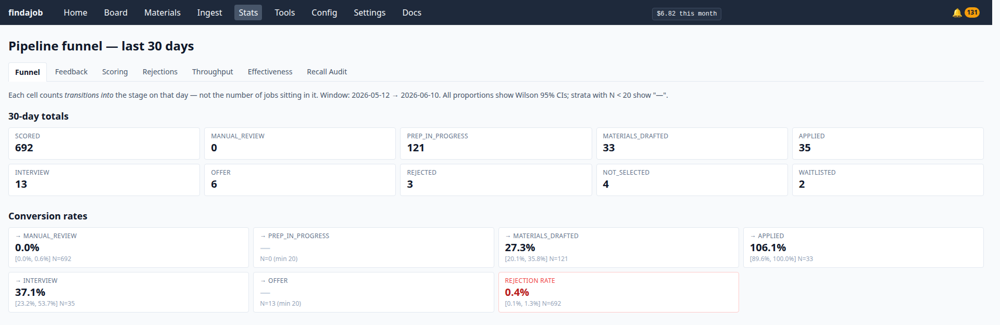
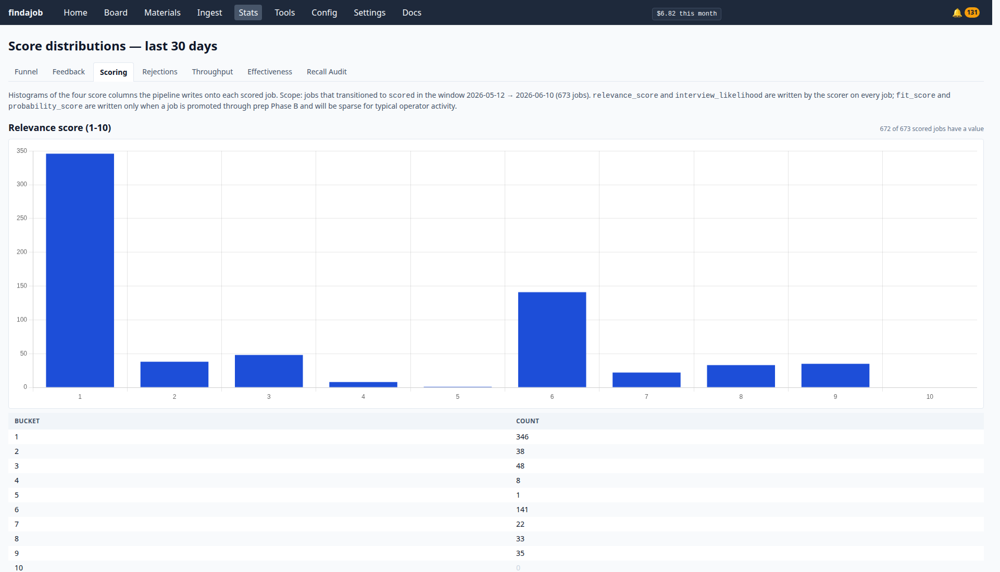
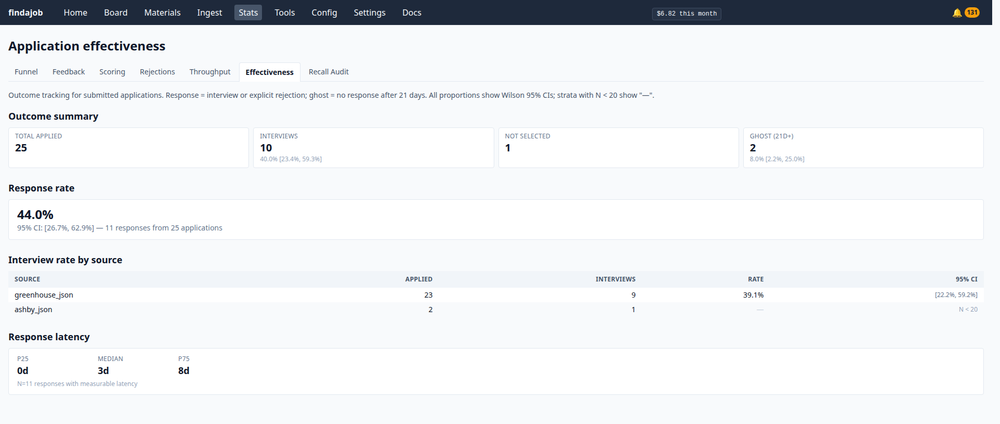

# Reading the Stats pages

The **Stats** tab (top nav → **Stats**, or `/stats/`) is where findajob shows you how your search is actually going — how jobs flow through the pipeline, which rejection reasons keep recurring, and whether your applications are landing responses. Every page reads your database live at request time, so the numbers are always current; there's no refresh lag and nothing cached.

`/stats/` opens on **Funnel**; a sub-nav across the top switches between the seven pages.

## Before you trust a number

A few things apply across every page:

- **Transitions, not snapshots.** Funnel and Throughput count how many times a job *moved into* a stage — not how many sit there right now. A job that went applied → interview → offer counts once under each; a job you re-applied to counts twice under "applied."
- **Small samples show `—`.** Every percentage carries a 95% confidence interval, and findajob hides the number entirely (shows `—`) until the sample is large enough to mean something. Expect a lot of `—` early in a search — that's honesty, not a bug.
- **Config-change markers.** On Funnel, Feedback, and Throughput, red dashed vertical lines mark the days you changed your config. Click one for a before/after popover, so you can see whether an edit actually moved the numbers.
- **Three different rejection cuts — don't conflate them.** *Feedback* counts only the rejections you logged (the signal that tunes scoring). *Rejections* counts everything, including company "Not Selected" emails, all-time, broken out by company. *Effectiveness* treats a "Not Selected" as a *response* (the company got back to you).

## Funnel — `/stats/funnel`

The 30-day view of your whole pipeline: how many jobs moved into each stage (scored → manual review → prep → materials drafted → applied → interview → offer), plus the three exits (rejected, not selected, waitlisted). Stage-to-stage **conversion rates** sit below the totals, each with a confidence interval, and a red-bordered **rejection rate** card shows how much of what you scored you ended up rejecting.

## Feedback — `/stats/feedback`

A 28-day trend of **your own** rejection reasons — the ones you tag as you clear your board — with a "this week" summary on top. These are exactly the signal that tunes tomorrow's scoring, so this page tells you what the scorer is learning from. Company-side "Not Selected" events are deliberately excluded here; see **Rejections** for those.

## Scoring — `/stats/scoring`

Histograms of the four scores the pipeline writes onto each job: **relevance** and **interview likelihood** (1–10, written on every scored job) and **fit** and **probability** (0–100, written only when you prep a job, so they stay sparse for typical activity). The relevance histogram is the one to watch — a healthy search has most jobs clustered low (correctly filtered out) with a meaningful bump at the high end (your real matches). A per-source breakdown below shows whether one job source is dragging your relevance down.

## Rejections — `/stats/rejections`

The all-time, by-company complement to Feedback. It counts **every** rejection — yours *and* company "Not Selected" archives — broken down by reason and by the companies where rejections concentrate. Use it to spot a company (or a reason) that's quietly eating a lot of your effort over the months.

## Throughput — `/stats/throughput`

Per-week counts of applications, interviews, and offers, stacked, all-time. Where Funnel is a 30-day daily window, this is the multi-month rhythm view: are you applying steadily, and is interview/offer volume keeping pace?

## Effectiveness — `/stats/effectiveness`

The outcome page: of the applications you submitted, how many got a **response** (an interview, an offer, or an explicit rejection), how many went dark (**ghosted** — no response after 21 days), how fast responses came back, and your interview rate broken out by source. Most of this gates to `—` until you have roughly 20 applications in, so it fills in as your search matures.

## Recall Audit — `/stats/recall-audit`

Every Sunday, findajob re-scores a sample of jobs it had hard-rejected or scored low, to catch good ones it might have dropped. An "upgrade" is a job the re-score rated higher than the original. An upgrade rate above 10% is a sign the scorer is too aggressive — findajob alerts you when that happens. This page is empty until the first Sunday audit runs.

## When a number tells you to act

The stats pages tell you *what's* happening; [`tuning.md`](../tuning.md) tells you *what to change*:

- Recurring rejection reasons (Feedback) → tighten your prefilter rules or sharpen your profile.
- A low interview rate from one source (Effectiveness) → adjust your source mix.
- A high recall-audit upgrade rate → loosen the scorer's threshold or revisit its prompt.
